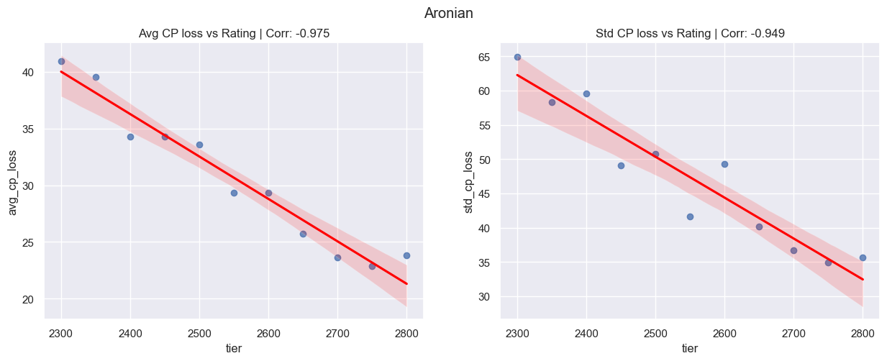
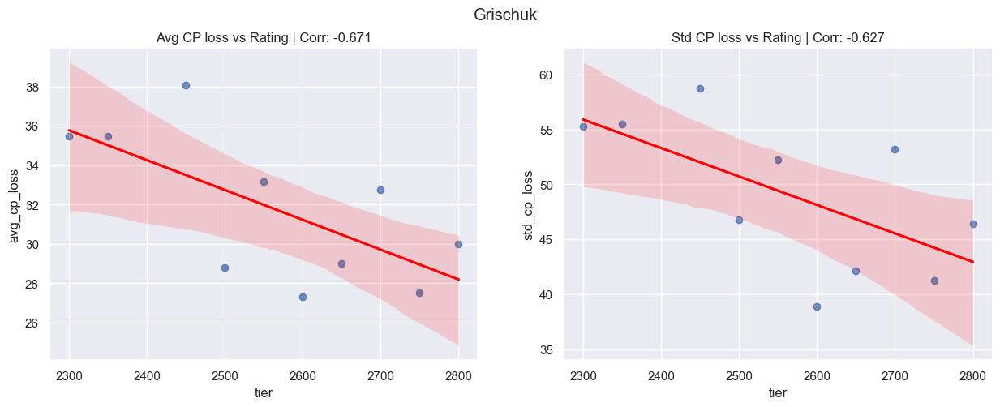

# Centipawn Loss Analyzer 
Jumping on the chess-cheating-scandal bandwagon and analyzing the ACPL (Average CentiPawn Loss) over time for a selected set of 25+ GMs.  
  - Games were filtered to only include OTB classical games (no online games, no bullet, blitz or rapid, no simuls, no blindfolds)
  - Opening moves (first 10) were filtered out
  - Short games (less than 10 moves after the opening moves) were filtered out
  - Games were analyzed using Stockfish 15 with depth 15

**TLDR;** 
  - Nothing suspicious found with regards to Niemann's ELO vs ACPL.
  - Statistical analysis cannot be trusted for a player where the number of games within certain ELO intervals is substantially underrepresented.

Here follows numerous plots of the findings...

---
#### Number of games analyzed per player 

---
#### ACPL distribution across all players

---
#### ACPL distribution per player (boxplot)

---
#### ELO vs ACPL trend across all players

---
#### ELO vs ACPL trend per player 

---

As a player's rating is not distributed evenly, but rather in a stepwise manner, it makes sense to group them into tiers (buckets) for certain stastistical analysis. Here I'm using a bucket size representing 50 ELO points.

#### Total number of games per tier

---
#### Number of games per tier per player

---
#### Overall ELO (tier) vs ACPL

---
#### ELO (tier) vs ACPL per player

---
#### Fraction of games with ACPL sub x % 

